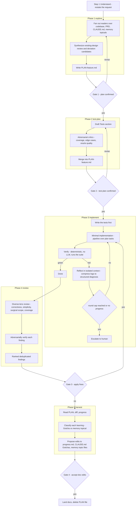
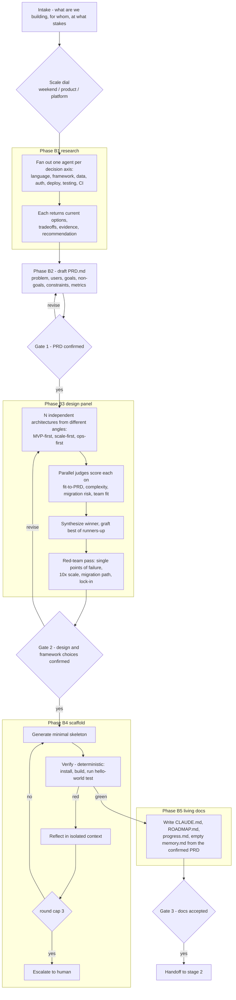

# PRD: The Ultimate Workflow — Graph Orchestration

**Status:** Draft for review. Supersedes `PRD_ The Ultimate Workflow Graph Agent.docx` (v0, Aug 2026).
**Date:** 2026-08-24
**Owner:** ValeroK
**Applies to:** `the-ultimate-workflow-guidelines` plugin, v3.0.0 target.

---

## 0. What changed since the v0 PRD, and why

The v0 PRD proposed: Claude Desktop as reasoning frontend, a local Python + LangGraph engine as the deterministic orchestrator, SQLite checkpointing for time-travel, all exposed to Claude over MCP.

That design was correct in its **diagnosis** and is now largely redundant in its **implementation**. Claude Code shipped, natively, four of the five things the v0 PRD wanted to build:

| v0 PRD component | Native equivalent shipped in Claude Code | Verdict |
|---|---|---|
| LangGraph execution engine | **Dynamic workflows** — a JavaScript orchestration script the runtime executes out-of-context (v2.1.154+) | Build on it, do not rebuild it |
| Deterministic edges / "ghost edit prevention" | **Hooks** — `PreToolUse` / `Stop` / `PostToolBatch` can hard-block a tool call or a turn | Build on it |
| SQLite checkpointer + time travel | **Checkpointing / `/rewind`** (per-prompt code + conversation snapshots) and the workflow **journal** (per-`agent()` resume cache) | Mostly covered; residual gap noted in section 8 |
| MCP tool boundary to reach the local engine | Not needed — the orchestrator runs inside the same process, with progress UI, pause/resume, per-agent inspection, and cost accounting | Drop |
| Context compressor / state-reducer | **Subagent context isolation** plus `schema`-validated structured returns | Covered, and better |

The one thing genuinely still missing is **cross-session durability** (section 8.1). Everything else is now a packaging problem, not an engineering problem.

**The reframe.** The v0 PRD assumed "graph" means a node/edge object model inside a framework. The industry has moved the other way: the strongest current position — and the one Claude Code implements — is that *the graph is ordinary control flow in a real programming language*, and the only thing that needs to be a "node" is a model call. We adopt that. We are not building a graph DSL. We are writing JavaScript whose call structure *is* the graph.

---

## 1. Executive summary and goal

`the-ultimate-workflow-guidelines` today is a **prompt-level** artifact: a skill body, a mirrored `CLAUDE.md`, and a Cursor rule that *describe* a six-step plan-first / test-first workflow. Compliance is advisory. The model can skip the plan, skip the tests, drift on step 6, and nothing stops it.

**Goal:** promote the workflow from *described* to *executed and enforced*, by expressing it as an orchestration graph over fresh-context subagents with deterministic gates on the edges — while keeping the plugin installable in one command with zero runtime dependencies.

**Success in one sentence:** the same six steps run the same way every time, the confirmation gates cannot be skipped, and the breadth-shaped steps (explore, review, harvest) get parallel fresh-context agents instead of one tired context window.

### Non-goals

- **Not** a general-purpose graph framework, DSL, or visual editor.
- **Not** a replacement for the existing skills. The skills remain the entry point and the always-on behavioral layer; the graph is what the skill *invokes* for the steps that benefit.
- **Not** an autonomous end-to-end agent. The human confirmation gates at steps 2 and 3 are the product, not an obstacle to route around.
- **Not** a Python service, a database, or an MCP server (see section 7 for the deferred tier that would need these).

---

## 2. Research findings: what is actually known about agent graphs

Sources listed in section 13.

### 2.1 Workflow vs. agent is the primary axis

Anthropic's framing: a **workflow** orchestrates LLMs and tools through predefined code paths; an **agent** lets the LLM direct its own process. The canonical patterns are prompt chaining, routing, parallelization (sectioning and voting), orchestrator-workers, and evaluator-optimizer. The stated default is to *start simple*: use the API directly, add agentic structure only when a simpler solution demonstrably falls short, and avoid frameworks that hide the prompts.

Applied here: our six steps are a **workflow**, not an agent. The sequence is known in advance. That is exactly the case where a graph earns its cost.

### 2.2 The state schema is the failure surface

Consistent across LangGraph production write-ups:

- Keep state **minimal and explicitly typed**. Pick one representation and hold it.
- Use **reducers only where accumulation is genuinely needed**. Everything else overwrites.
- **Separate transient from durable.** Raw tool output (test logs, stack traces, grep dumps) must never enter permanent conversational memory. Compress first, then append.
- Nodes should be **pure functions returning partial state updates**, not mutators. That is what makes them testable and the routing predictable.
- LangChain's 2026 State of Agent Engineering report attributes **over 60% of production incidents to state management**.

This is the single most transferable finding, and it is the part of the v0 PRD that was most right.

### 2.3 Termination conditions are a top-3 failure mode

The Berkeley **MAST** taxonomy (1,600+ annotated traces across 7 frameworks, Cohen's kappa 0.88) buckets multi-agent failures into three categories:

- **Specification / system design** — roughly 41.8%. Task misinterpretation, ambiguous roles, poor decomposition, **missing termination conditions**.
- **Inter-agent misalignment** — roughly 36.9%. Communication breakdown, context loss at handoff, conflicting outputs, format mismatch.
- **Verification / termination** — the remainder.

Named modes worth designing against: *step repetition* (15.7%), *unaware of termination conditions* (12.4%), *disobey task specification* (11.8%).

The conclusion the authors draw is the important one: **most failures are design failures, not model failures.** Bigger models do not fix them. Explicit termination predicates, schema-validated handoffs, and role separation do.

### 2.4 Multi-agent costs roughly an order of magnitude

Anthropic's multi-agent research system consumed about **15x the tokens** of a chat, and token volume explained the large majority of the quality gain — parallelism buys compute and context headroom, not cleverness. It beat single-agent Opus 4 by 90.2% on their internal eval, but only on breadth-shaped tasks.

Applied here: **fan out only where breadth beats depth.** Exploring a codebase, reviewing a diff along several lenses, and harvesting learnings are breadth-shaped. Writing one function is not. A graph that parallelizes linear work just pays 15x for the same answer.

### 2.5 The counter-position, and its own reversal

Cognition's "Don't Build Multi-Agents" (Jun 2025) is the strongest stated case against: dispersed decision-making plus incompletely shared context produces fragile systems; prefer a single-threaded linear agent with continuous context and a dedicated compression model. In Mar 2026 Cognition shipped a coordinator that manages isolated Devins anyway, justified by "context accumulates, focus degrades."

Both positions are correct about different things, and the synthesis is the design rule we adopt:

> **Agents produce findings. Code and humans make decisions.**

Every branch in our graph is either a JavaScript conditional or a human gate. No subagent ever decides what runs next. That removes the dispersed-decision failure mode while keeping the context-isolation benefit.

### 2.6 "Own your control flow" — the graph DSL is the wrong abstraction

The recurring criticism of graph frameworks is that general-purpose languages already have loops, conditionals, and composition with compile-time checking, and that re-encoding them as node/edge objects adds ceremony without adding capability. Claude Code's dynamic workflows are the practical endorsement of that critique: the orchestration is plain JavaScript with top-level `await`, and the only framework-ish primitives are `agent()`, `parallel()`, `pipeline()`, and `workflow()`.

We follow that. **No graph DSL. The JS call graph is the graph.**

### 2.7 Consolidated best-practice checklist

Carried into the design in section 5:

1. Deterministic steps get **zero** LLM involvement. A test runner is a subprocess, not an agent.
2. Every agent return is **schema-validated** at the tool-call layer, not parsed out of prose.
3. Every loop has a **hard round cap** and an explicit **no-progress predicate**; exceeding either escalates to a human.
4. **Transient state never touches durable memory** uncompressed. Isolate it in a subagent context and return only the structured diagnosis.
5. Prefer **pipeline (streaming) over barrier (parallel)**; a barrier is justified only when a stage needs the full prior result set at once (dedup, early exit, cross-comparison).
6. **Isolate writers.** Parallel agents that edit files need separate git worktrees; otherwise partition file ownership.
7. **Verify adversarially**, and with **diverse lenses** rather than N identical checkers, when a finding can fail in more than one way.
8. **Nothing is silently capped.** If the run truncates, samples, or drops, it says so in the output.
9. **Persist to human-readable files**, not only to engine-internal state. Files survive process death, tooling churn, and vendor changes.
10. **Test the graph, not just the nodes.** Assert on resulting state and on which edge was selected.

---

## 3. Substrate: what Claude Code gives us

Verified against current Claude Code documentation.

### 3.1 Dynamic workflows

- A workflow is a JavaScript script the runtime executes **in the background, out of the conversation's context**. Only the final return value lands in Claude's context.
- Requires **v2.1.154+**. Available on all paid plans, Anthropic API, Bedrock, Google Cloud Agent Platform, Microsoft Foundry. On Pro, enable via the Dynamic workflows row in `/config`.
- Primitives: `agent(prompt, opts)`, `parallel(thunks)` (barrier), `pipeline(items, ...stages)` (no barrier), `workflow(name, args)` (one level of nesting), plus `phase()`, `log()`, `args`, `budget`.
- `opts.schema` forces a structured-output tool call with validation and model retry — the reliable path to typed handoffs.
- `opts.isolation: 'worktree'` gives an agent its own git checkout.
- `opts.model` / `opts.effort` / `opts.agentType` route a stage to a different tier.
- **Runtime limits:** no mid-run user input (only permission prompts pause a run); no filesystem or shell access from the script itself (agents do the work, the script coordinates); no module loading (`import()` fails the run); up to **16 concurrent agents**; **1,000 agents total per run**; `Date.now()` / `Math.random()` / argless `new Date()` throw, because they would break resume.
- **Resume** replays the journal: cached results stop at the first agent that did not finish, and every agent that *started* after that one re-runs. Consequence: many small agents preserve more progress than one long agent.
- Subagents inside a workflow always run in `acceptEdits` and inherit the session tool allowlist, regardless of the session's permission mode. File edits are auto-approved; unallowlisted shell, web, and MCP calls can still prompt mid-run.
- Default **size guideline** is `medium` (aim under 15 agents), settable via `workflowSizeGuideline` in settings or `/config`.

### 3.2 Distribution via plugin

This is the load-bearing fact for us: **a plugin can ship workflows.** Place scripts in a `workflows/` directory at the plugin root (or point the `workflows` field in `plugin.json` at another path). They are namespaced by plugin name and appear as `/<plugin-name>:<workflow-name>` in `/` autocomplete, exactly like our skills already appear.

So the delivery mechanism for everything in this PRD is the plugin we already publish. No new install surface.

### 3.3 Hooks as deterministic edges

Hook events that can **block**: `PreToolUse`, `UserPromptSubmit`, `UserPromptExpansion`, `Stop`, `SubagentStop`, `PostToolBatch`, `TaskCreated`, `TaskCompleted`, `ConfigChange`, `PreCompact`, `WorktreeCreate`, `Elicitation`. Blocking is either exit code 2 or a JSON `decision: "block"` / `permissionDecision: "deny"` on stdout. `UserPromptSubmit` can additionally inject `additionalContext`.

We already ship two hooks (`hooks/hooks.json`, no-emoji prompt plus write). The pattern, the manifest, and the dependency-free Node style are proven in this repo.

### 3.4 Checkpointing and rewind

`/rewind` (alias `/checkpoint`, or Esc-Esc) restores code, conversation, or both, to any prior user prompt. Checkpoints are automatic per prompt and retained 30 days by default. **Limitation:** it only covers files touched by Claude's file-editing tools — anything a Bash command wrote is invisible to it. Git remains the real rollback substrate.

### 3.5 Claude Code Desktop specifically

The user-facing question was "how do we leverage this from Claude Code desktop." The answer is that **there is nothing desktop-specific to build.** Claude Code CLI and the Claude Code Desktop app run the same engine and share project memory, `CLAUDE.md`, settings, MCP servers, hooks, skills, plugins, and permission rules. Workflows are available in the CLI, the Desktop app, the IDE extensions, `claude -p`, and the Agent SDK.

What the Desktop app adds is **presentation**, and it happens to suit this design well:

- Workflow launch shows an **approval card** with the workflow name, the phase list, and a token-usage caution, with Once / Always / Deny actions.
- Progress appears in the **Background tasks side pane** rather than a TUI, so the conversation stays readable while a phase runs.
- Parallel sessions have a dedicated desktop view.

Note the distinction the v0 PRD blurred: **Claude Desktop** (the app, with Chat / Cowork / Code tabs) is the container; **Claude Code** is the engine in the Code tab. The v0 PRD's "Claude Desktop as reasoning frontend talking to a local Python engine over MCP" would put a second orchestrator *outside* the surface that already has one, and lose the approval card, the progress pane, pause/resume, per-agent inspection, and cost accounting in the process.

---

## 4. The graphs

The plugin serves **two stages of software development**, and they need **two different graphs**. This is the most important structural point in the document, and the first draft of this PRD missed it: it designed only for stage 2.

- **Stage 1 — day zero.** `project-bootstrap-guidelines`. A blank slate becomes a PRD, a confirmed system design, and four living docs.
- **Stage 2 — existing project.** `the-ultimate-workflow-guidelines`. A feature is planned, tested, implemented, reviewed, and harvested into durable memory.

They are not the same graph with different prompts. They differ in the one property that determines graph shape: **what the ground truth is, and what can verify against it.**

| | **Stage 1 — day zero** | **Stage 2 — existing project** |
|---|---|---|
| Ground truth | None. It is being created | The codebase. It already exists |
| Direction of fan-out | **Divergent** — generate competing alternatives | **Convergent** — read one known artifact from many angles |
| Canonical pattern (section 2.1) | Parallelization-**voting** plus judge panel | Parallelization-**sectioning** plus orchestrator-workers |
| Verification oracle | The human, plus one hard check: **does the scaffold actually build** | The test suite. Deterministic, green or red |
| Dominant failure mode | Premature convergence on the first plausible architecture; stale framework knowledge | Drift from existing design; scope creep |
| Decision profile | Few decisions, expensive, hard to reverse | Many decisions, cheap, repeated |
| What the graph buys | **Breadth** — options genuinely considered rather than defaulted into | **Enforcement plus context isolation** |
| Risk of graph overkill | High. A four-architecture judge panel on a weekend project is absurd | Low. The cycle repeats, so the cost amortizes |

The two graphs share a spine — the gates of section 5, the memory model, and the `harvest` phase — and diverge everywhere else.

### 4.1 Stage 2: the feature graph

Six steps from the existing workflow, expressed as phases. Rectangles are graph phases; diamonds are gates.



### 4.2 Why one workflow per phase, not one workflow for the whole loop

Because the runtime states plainly: **no mid-run user input; for sign-off between stages, run each stage as its own workflow.** Our confirmation gates are the product. So the decomposition is forced, and happily it is also the right one:

- Each phase is independently rerunnable and independently costable.
- A blown phase is cheap to redo; a blown five-phase monolith is not.
- The human gate is where it belongs — between phases, in the conversation, with the plan file on disk as the artifact under review.

### 4.3 Node classification

| Node | Type | Rationale |
|---|---|---|
| Fan-out readers | LLM, parallel, schema'd | Breadth-shaped; fresh contexts avoid one bloated window |
| Synthesize design review | LLM, single, schema'd | Needs all reader output at once — a legitimate barrier |
| Write PLAN file | LLM, single | One writer, one file |
| Test-plan critics | LLM, parallel, diverse lenses | A weak test plan fails in several distinct ways |
| Implement | LLM, pipeline, worktree-isolated when parallel | Writers must not collide |
| **Verify** | **Deterministic. No LLM.** | Carried forward unchanged from v0 PRD. The suite's exit code is the truth |
| Reflect | LLM, single, isolated context, schema'd | This *is* the state-reducer: the stack trace dies in the subagent, a structured diagnosis returns |
| Review lenses | LLM, parallel, diverse lenses | Correctness, simplicity, scope, and coverage are orthogonal |
| Verify findings | LLM, parallel skeptics, majority rule | Kills plausible-but-wrong findings before they reach the user |
| Harvest / classify | LLM, single, schema'd | Applies the existing Gotcha-vs-Memory decision test |

### 4.4 State

Two stores, deliberately both human-readable files. No database.

**Durable (survives everything):**

- `PLAN-<feature>.md` — the accumulating plan, already the plugin's core artifact. Gains a small YAML front-matter block: `phase`, `plan_confirmed`, `tests_confirmed`, `verify_rounds`, `last_verify` (`green` / `red` / `unrun`), `escalated`.
- `progress.md`, `CLAUDE.md ## Gotchas`, `memory/<topic>.md` — the existing long-term stores, unchanged.
- Git — the rollback substrate.

**Transient (dies with the run):**

- Workflow script variables. Reader excerpts, raw test output, unverified findings. None of it enters the conversation.

The front-matter block is the only new state, it is about eight lines, and it is what the hooks in section 5 read. That is the entire state schema.

### 4.5 Termination, explicitly

Per MAST, this gets stated rather than assumed:

- Implement/verify loop: **hard cap 3 rounds**, plus a no-progress predicate (failing-test count did not decrease and the failure signature is unchanged). Either trips the escalation edge.
- Review loop: findings are produced once per invocation. Reapplying fixes re-enters phase 3 and re-consumes its round budget rather than opening a second unbounded loop.
- Every fan-out is over a **finite enumerated list**, never "keep looking until satisfied."
- Escalation is a **terminal state that returns to the human**, not a retry with a bigger prompt.

### 4.6 Stage 1: the day-zero graph

Three phases from `project-bootstrap-guidelines`, expressed as a graph. Note the shape: it opens **wide** (research and competing designs) and narrows, where stage 2 opens **wide on reading** and narrows onto one implementation.



Four things in here are new relative to the current bootstrap skill, and each addresses a real observed failure:

**1. The research fan-out (B1) is the single biggest quality win available at day zero.** Framework choices made from training data are stale by construction, and stage 1 is exactly where an unexamined default gets locked in for the project's lifetime. One web-grounded agent per decision axis, each returning a schema'd `{axis, options[], tradeoffs, recommendation, evidence}`, is textbook breadth-shaped work. The current skill asks the model to document "alternatives considered" from memory. This makes that claim true.

**2. The design panel (B3) is parallelization-voting, not sectioning.** Generate several complete architectures from deliberately different angles, judge them in parallel against the confirmed PRD, then synthesize from the winner while grafting the best ideas from the runners-up. This is the documented judge-panel quality pattern, and stage 1 is the case it was built for: a wide solution space, one expensive irreversible choice, no test suite to arbitrate.

**3. The red-team pass (B3, final node) is the closest stage 1 gets to adversarial verification.** There is no green/red oracle for an architecture, so the substitute is a skeptic prompted to break it: what is the single point of failure, what happens at 10x, what is the migration path out, where is the lock-in. Findings feed gate 2 rather than auto-applying.

**4. The scaffold-verify node (B4) is the one hard oracle day zero has.** Once framework choices are confirmed, "does `install` then `build` then the hello-world test actually pass" is deterministic, cheap, and catches the failure mode that a design document never will: **a framework combination that does not actually work together**. Hallucinated version compatibility is common and expensive to discover in week three. This node makes the day-zero graph verifiable in exactly the way section 2.7 rule 1 demands, and it is the reason stage 1 gets a graph at all rather than just a better prompt.

**The scale dial** is stage 1's answer to section 2.4, and it is **asked, not defaulted** (section 10.1, Q6). The very first thing bootstrap does is ask what the stakes are, with the cost of each option stated: `weekend` runs B1 with three axes and B3 with two architectures and no judge panel; `product` runs five and three with a panel; `platform` runs seven and four. The answer is written to `PRD.md` front-matter as `scale` and read from there by every later stage-1 workflow, so the question is asked once. Stage 2 amortizes its cost across many cycles and can hold a fixed shape; stage 1 spends its whole budget once, so the human sizes it.

### 4.7 What the two graphs share

The spine, and only the spine:

- **The gates of section 5**, with a stage discriminator (see 5.1).
- **The memory model** — `## Gotchas` versus `memory/<topic>.md`, and the decision test between them.
- **The `harvest` phase**, unchanged. Stage 1 harvests the design rationale into `memory/architecture.md` at handoff; stage 2 harvests per feature.
- **The escalation contract** — round cap, no-progress predicate, terminal return to the human.
- **The rule that agents produce findings and code or humans decide.**

Everything else differs, and trying to force one graph to serve both would produce a graph that serves neither.

### 4.8 The handoff edge

The bootstrap skill currently says "hand off to `the-ultimate-workflow-guidelines` once bootstrap docs exist." In graph terms that is a terminal edge with an implicit predicate, which is exactly the ambiguity MAST catalogues under specification failures. Make it explicit and checkable:

> **Stage 1 is complete when** `PRD.md` exists with a confirmed design section, `CLAUDE.md` exists with `## Key files` and an empty `## Gotchas`, `ROADMAP.md` has at least one milestone, `progress.md` has its first dated entry, `memory.md` exists, and the scaffold-verify node last returned green.

That predicate is a function of the filesystem, so the phase-pointer hook (G5) can evaluate it and tell the model which stage it is in without being told. That single check is what stops the most common cross-stage failure: running feature-workflow prose against a project that has no design yet, or re-running bootstrap against a project that already has one.

---

## 5. Deterministic gates (hooks)

The graph describes what *should* happen. The hooks make the illegal transitions impossible. This is v0's "ghost edit prevention," generalized, and it is the highest value-per-line part of the whole proposal — it needs no workflow runtime at all.

| Gate | Hook | Behavior |
|---|---|---|
| **No code before a confirmed plan** | `PreToolUse` on `Write\|Edit\|MultiEdit` | Deny if the target is source (not `PLAN-*.md`, not docs) and no `PLAN-<feature>.md` with `plan_confirmed: true` exists. Reason string names the missing gate |
| **No implementation before tests** | `PreToolUse` on `Write\|Edit` | Deny edits to source while `tests_confirmed: false`. Test files are exempt — that is the point |
| **Coding must route through verify** | `Stop` | Block turn completion when source files changed since the last recorded `last_verify: green`. Reason string names the test command from the plan |
| **Round cap** | `PostToolUse` on the test command | Increment `verify_rounds`; at 3, set `escalated: true` and inject an escalation instruction |
| **Phase pointer** | `UserPromptSubmit` | Inject one line of `additionalContext`: current phase and next required action. Cheap, deterministic, defeats phase drift after compaction |

Design constraints on the hooks, matching the two already shipped:

- Node, zero dependencies, single file each, under roughly 80 lines.
- Fail **open** on any internal error. A crashed hook must never wedge a session.
- Honor an escape hatch env var, as `ALLOW_EMOJIS=1` already does. Proposed: `ULTIMATE_WORKFLOW_GATES=off`.
- Never block when no `PLAN-*.md` exists at all — that is the "trivial task, skipping the workflow" case the skill already sanctions.

### 5.1 The stage discriminator — a correction to the gate design

The gate table above was written for stage 2 only, and as specced it **silently does nothing at day zero**. Every predicate keys off `PLAN-<feature>.md`, which does not exist during bootstrap. That is backwards: day zero is arguably the *more* dangerous phase to leave ungated, because a bad framework choice is far harder to reverse than a bad function.

Fix: the shared hook core resolves a **stage** before evaluating any gate, from the filesystem alone, using the section 4.8 predicate.

| Resolved stage | Condition | Gate behavior |
|---|---|---|
| `none` | No `PRD.md`, no `PLAN-*.md` | All gates no-op. Trivial task or unmanaged repo |
| `bootstrap` | `PRD.md` exists but the 4.8 handoff predicate is unmet | Stage-1 gates active (below) |
| `feature` | Handoff predicate met | Stage-2 gates active (section 5 table) |

Stage-1 gate set, mirroring stage 2's shape against different artifacts:

| Gate | Hook | Behavior |
|---|---|---|
| **B-G1: no scaffold before a confirmed PRD** | `PreToolUse` on write tools | Deny writes outside `PRD.md` and docs while `prd_confirmed: false` |
| **B-G2: no scaffold before a confirmed design** | `PreToolUse` on write tools | Deny source writes while `design_confirmed: false`. This is the gate that protects the irreversible decision |
| **B-G3: scaffold must build** | `Stop` | Block turn completion when scaffold files changed since the last `scaffold_verify: green` |
| **B-G4: round cap** | `PostToolUse` | Same counter, same escalation, against the build command |
| **B-G5: stage pointer** | `UserPromptSubmit` | Inject resolved stage plus next required action. Same hook as G5, one branch wider |

So it is five gates with a stage-dependent predicate, not ten gates. The state block gains `stage`, `prd_confirmed`, `design_confirmed`, `scaffold_verify`, and lives in `PRD.md` front-matter during bootstrap and `PLAN-<feature>.md` front-matter thereafter. Same parser, two locations.

**Consequence for open question Q2.** "Ship hooks first" was recommended on reach grounds. With the stage discriminator, that recommendation gets stronger: the hooks release covers both stages and four vendors, while the workflow release covers both stages on one vendor.

---

## 6. Scope

### 6.1 In scope for v3.0.0

**A. Eight plugin workflows** in `workflows/` — three for stage 1, five for stage 2.

Stage 1 (`project-bootstrap-guidelines`):

| Command | Phase | Shape |
|---|---|---|
| `bootstrap-research` | B1 | One web-grounded agent per decision axis, width set by `args.scale`; schema'd options, tradeoffs, evidence, recommendation; barrier; draft `PRD.md` |
| `bootstrap-design` | B3 | N independent architectures from different angles; parallel judges score against the confirmed PRD; synthesize winner grafting runners-up; red-team pass; fold into `PRD.md` |
| `scaffold-verify` | B4 | Generate skeleton; deterministic install/build/hello-world stage; isolated-context reflect on red; round cap 3; escalate |

Stage 2 (`the-ultimate-workflow-guidelines`):

| Command | Phase | Shape |
|---|---|---|
| `explore` | 2 | Fan-out readers over subsystems, bootstrap docs, and matching `memory/` topicals; barrier; synthesize existing-design review and deviation candidates; write `PLAN-<feature>.md` |
| `test-plan` | 3 | Draft, then N diverse critics (coverage, edge cases, oracle quality, runnability); merge; append Tests section |
| `implement` | 4 | Pipeline over plan tasks; tests first; deterministic verify stage; isolated-context reflect on red; round cap; escalate |
| `review` | 4/5 | Diverse-lens review (correctness, simplicity, **surgical scope**, test coverage) then adversarial verification per finding; ranked deduplicated output |
| `harvest` | 6 | Read plan, diff, and progress; classify each learning against the existing Gotcha-vs-Memory decision test; propose concrete file edits |

`review`'s **surgical scope** lens is the direct mechanization of the plugin's existing Surgical Changes principle: an agent whose sole job is to ask, per changed line, "does this trace to the request?" That check has never had an enforcer before.

`harvest` is the highest-leverage of the five. Step 6 is the plugin's weakest link today, because doc-updating happens at the very end of a long, tired context. Fresh-context agents reading the plan and the diff fix exactly that.

**B. Five stage-aware hooks** per sections 5 and 5.1, added to the existing `hooks/hooks.json`, built on a shared core with per-vendor adapters per section 11.5.

**C. State front-matter** — the state block, added to both `references/plan-template.md` (stage 2) and `references/prd-template.md` (stage 1). Same parser, two locations.

**D. Skill integration, both skills** — bootstrap phases 1 to 3 and workflow steps 2, 3, 4, and 6 each gain an "if dynamic workflows are available, invoke `/<plugin>:<name>`; otherwise follow the prose below" branch. **The prose stays.** This is the graceful-degradation requirement: Cursor, Codex, Gemini, claude.ai skill uploads, and pre-2.1.154 Claude Code all keep working exactly as today.

**E. Subagent definitions** in `agents/` — the same eight phase prompts and schemas exported as subagent definitions, so Cursor, Codex, and Gemini get explicit `/explore`, `/review`, `/harvest` invocations with model-driven dispatch. Same prompts, no determinism.

**F. Docs** — `README.md` section, `CHANGELOG.md`, a `memory/graph-orchestration.md` topical capturing the design rationale, and `CLAUDE.md ## Gotchas` entries for the runtime constraints that will bite (no `Date.now()`, no `import()`, no mid-run input, resume replay semantics, Codex concurrent-hook races, Gemini stdout suppression).

### 6.3 Repository layout

What lands where. New paths marked NEW; everything else exists today.

```
the-ultimate-workflow-guidelines/
  .claude-plugin/plugin.json
  .cursor-plugin/plugin.json
  plugin.json                        NEW  Codex CLI manifest
  gemini-extension.json              NEW  Gemini CLI manifest
  hooks/
    hooks.json                            existing, gains 5 gate entries
    no-emoji-prompt.js                    existing
    no-emoji-write.js                     existing
    lib/                             NEW
      state.js                       NEW  front-matter read/write, stage resolution, gate predicates
      gates/                         NEW  plan, tests, verify, round-cap, phase-pointer
      adapters/                      NEW  claude-code.js, codex.js, gemini.js, cursor.js
  workflows/                         NEW  Claude Code only
    bootstrap-research.js            NEW  stage 1
    bootstrap-design.js              NEW  stage 1
    scaffold-verify.js               NEW  stage 1
    explore.js  test-plan.js  implement.js  review.js  harvest.js   NEW  stage 2
  agents/                            NEW  same prompts as subagent defs for Cursor / Codex / Gemini
  skills/
    the-ultimate-workflow-guidelines/     existing, gains invoke-or-fallback branches
    project-bootstrap-guidelines/         existing, gains invoke-or-fallback branches
  rules/                                  existing, gains a Claude-Code-only note
```

The mirror discipline the README already documents (skill body equals `CLAUDE.md` equals `.mdc` rule) now extends to a second axis: **one phase prompt, three consumers** — the workflow script, the subagent definition, and the skill prose. Keeping those three in sync by hand is the main maintenance cost this proposal adds, and it should be called out as such rather than discovered later. A single `phases/<name>.md` source that all three reference is worth considering before writing them three times.

### 6.2 Explicitly out of scope

- Python, LangGraph, SQLite, any MCP server (deferred tier, section 7).
- A visual graph editor or a graph definition format.
- Autonomous removal of the human gates.
- Replacing `/rewind` or git with custom rollback.

---

## 7. Rejected and deferred alternatives

| Option | Why not now |
|---|---|
| **v0 architecture: local Python + LangGraph over MCP** | Two competing control loops on the same repo; duplicate permission and sandbox models; MCP returns one blob instead of streaming phase progress into the session; destroys the plugin's zero-dependency one-command install; requires packaging a Python service for Windows and macOS. Buys only the cross-session durability in 8.1, at very high cost |
| **One monolithic workflow for all six steps** | The runtime cannot take mid-run user input, so the confirmation gates would have to be deleted. Those gates are the product |
| **Agent teams as the orchestrator** | Experimental and off by default; the lead agent decides turn-by-turn, which reintroduces exactly the dispersed-decision failure mode section 2.5 warns about |
| **Encode the graph as a JSON/YAML node-edge spec interpreted by a script** | Section 2.6. Adds a DSL, a parser, and a validator to express what JS control flow already expresses with compile-time checking |
| **Skip workflows, ship hooks only** | Viable and genuinely tempting — the hooks deliver most of the enforcement value alone. But it leaves the breadth-shaped steps (explore, review, harvest) single-context, which is where the real quality gain sits. Recommendation: ship hooks **first** as an independently useful increment, workflows second |

---

## 8. Known gaps and risks

### 8.1 Cross-session durability (the one real residual gap)

Workflow resume works **only within the same Claude Code session**. Exit Claude Code mid-run and the next session starts the workflow fresh. This is precisely what v0's SQLite checkpointer would have solved.

**Mitigation, and why it is adequate:** our durable state is `PLAN-<feature>.md` plus git, not engine state. A lost run costs the tokens of one phase, and the phase is rerunnable from the plan file. The phase decomposition in 4.1 already bounds that loss. We accept the gap; revisit only if phase reruns prove expensive in practice.

### 8.2 Resume replay is order-sensitive

Cached results stop at the first agent that did not finish, and **every agent that started after it re-runs even if it completed**. Stopping mid fan-out is therefore expensive. Design response: prefer many small agents over few long ones, which is already the shape of every phase here.

### 8.3 Cost

Multi-agent runs are documented at roughly 15x single-agent token use, count against plan limits, and trigger a `Large workflow` warning past 25 agents or 1.5M projected tokens. Design responses: default `workflowSizeGuideline: medium`; route mechanical stages to a cheaper model or `effort: 'low'`; scale fan-out width to the enumerated work list rather than a fixed constant; document the cost in the README so nobody installs this expecting it to be free.

### 8.4 Availability fragmentation

Workflows need v2.1.154+ and a paid plan, and can be disabled per-user or per-org. Cursor and claude.ai skill uploads never get them. Design response: the skill prose is the fallback path and stays authoritative. A workflow is an accelerator, never a prerequisite.

### 8.5 Hooks can wedge a session

A blocking `Stop` hook with a logic bug can make a turn unfinishable. Design response: fail open on every internal error, `ULTIMATE_WORKFLOW_GATES=off` escape hatch, and no gate fires at all when no `PLAN-*.md` is present.

### 8.6 Command namespace ergonomics

Plugin workflows are namespaced by plugin name, giving `/the-ultimate-workflow-guidelines:explore`. That is 38 characters before the colon. See open question Q1.

### 8.7 Permission surprise

Subagents inside a workflow run in `acceptEdits` and auto-approve file edits regardless of the session's permission mode. Users in Manual mode will not expect that. It must be stated prominently in the README, not buried.

---

## 9. Success criteria

Measurable, in the spirit of the plugin's own Goal-Driven Execution principle:

1. **Enforcement:** with gates on, an attempt to edit source without a confirmed plan is blocked, and the block message names the missing gate. Verified by a scripted transcript test.
2. **Termination:** a deliberately unfixable failing test escalates after exactly 3 verify rounds, and does not loop further.
3. **Context hygiene:** a failing run's raw stack trace never appears in the main conversation; only the structured diagnosis does.
4. **Degradation:** with `disableWorkflows: true`, every skill path still completes end to end via the prose fallback.
5. **Cost:** a full five-phase cycle on a small feature stays under the `medium` size guideline (fewer than 15 agents per phase).
6. **Harvest quality:** on a feature that produced a genuine footgun and a genuine architectural decision, `harvest` routes them to `## Gotchas` and `memory/<topic>.md` respectively, per the existing decision test.
7. **Install:** still one command, still zero runtime dependencies beyond Node (already required by the existing hooks).

### 9.1 How the gates are tested

The gates are the most testable artifact in this proposal, and that is a large part of why they ship first. A hook is a Node script that reads JSON on stdin and returns JSON plus an exit code — a pure function of `(payload, filesystem state)`. Three tiers, none of which needs a paid plan or a network call.

**Tier 1 — unit tests on the shared core.** `hooks/lib/state.js` and each gate predicate, tested directly. Node 18+ ships `node:test` and `node:assert` in the standard library, so this adds **no dependency and no `package.json`** — the repository keeps having no npm surface at all, which is the property that decided the architecture in section 7.

```
node --test "hooks/**/*.test.js"
```

The glob must be quoted so Node expands it rather than the shell, which keeps the command identical on Windows and Linux. Note that `node --test hooks/` does **not** work: a directory argument is resolved as a module path, not as a search root. CI pins `actions/setup-node` to a known major for a predictable runner version.

Table-driven, one case per row of the section 5 and 5.1 gate tables. Example shape: given a temp directory containing `PLAN-x.md` with `plan_confirmed: false`, assert `resolveStage()` returns `feature` and `planGate({tool: 'Edit', path: 'src/a.ts'})` returns a deny whose reason names the missing gate.

Two behaviors that are easy to forget and must be explicitly covered:

- **Fail-open.** Inject a throw into the core and assert the hook still exits 0 and blocks nothing. This is the property that keeps a bug from wedging someone's session, so it gets a test, not a comment.
- **Stage `none` no-ops.** No `PRD.md`, no `PLAN-*.md` means every gate passes through. Otherwise the plugin breaks trivial edits for everyone.

**Tier 2 — contract tests against recorded payloads.** Tier 1 proves the logic; tier 2 proves the wiring, including the four vendor adapters. Spawn the hook as a subprocess, write a real payload to stdin, assert on exit code and parsed stdout.

The payloads must be **recorded, not hand-written from the docs** — the whole point is to catch places where a vendor's actual wire format differs from its documentation, which is exactly the open risk on Cursor. Ship a throwaway `hooks/dev/record.js` that copies stdin to `fixtures/<vendor>/<event>.json` and exits 0, register it for every event in each of the four CLIs, run one ordinary session in each, and the fixture set is complete. Adapters are then tested against reality.

This also converts the Cursor `preToolUse` unknown from an argument into a 10-minute experiment: record a `preToolUse` payload for an edit tool, return `permission: "deny"`, observe whether the edit happens.

**Tier 3 — acceptance scenarios in a real session.** Roughly eight scenarios, a couple of minutes each, run manually before a release and kept as a checklist in the repo:

| # | Scenario | Expected |
|---|---|---|
| S1 | Fresh repo, no `PRD.md` or `PLAN-*.md`, ask for a source edit | Allowed. Stage `none` no-ops |
| S2 | `PLAN-x.md` with `plan_confirmed: false`, ask for a source edit | Denied; reason names the gate |
| S3 | `plan_confirmed: true`, `tests_confirmed: false` | Test-file edit allowed, source edit denied |
| S4 | `tests_confirmed: true`, edit source, try to end the turn | `Stop` blocks; reason names the test command |
| S5 | Run the test command green, end the turn | Turn completes cleanly |
| S6 | Deliberately unfixable test | Escalates after exactly 3 rounds; no 4th |
| S7 | `ULTIMATE_WORKFLOW_GATES=off` | S2 through S6 all pass through |
| S8 | `disableWorkflows: true` | Both skills complete end to end on the prose path |

**CI.** `.github/workflows/validate.yml` already runs manifest JSON checks and a version-consistency assertion. Tiers 1 and 2 join it. Tier 3 stays manual because it needs a live agent session.

**Dogfooding answers the one thing tests cannot.** Whether the `Stop` gate feels right or feels like nagging (section 12.6) is a taste question, and no assertion settles it. The answer is to install the v2.4.0 gates in this repository and build v3.0.0 under them. If the gates are unpleasant while building the workflows, that is the signal — found before eight workflow scripts depend on them, which is the whole argument for this ship order.

---

## 10. Resolved decisions and remaining questions

### 10.1 Resolved

**Q1 — Namespace. RESOLVED: the plugin `name` becomes `ultimate-workflow`.** Commands read `/ultimate-workflow:explore`, `/ultimate-workflow:harvest`; skills read `ultimate-workflow:the-ultimate-workflow-guidelines`. The repository name, README branding, and marketplace display name are unaffected — only the `name` field in the three manifests changes. Existing marketplace installs break once; this is a major version, and the CHANGELOG carries the migration note. Rationale for doing it now rather than later: the doubled name is already awkward today, and eight new commands make it strictly worse. The escape-hatch env var follows the name: `ULTIMATE_WORKFLOW_GATES=off`.

**Q2 — Ship order. RESOLVED: gates first.** `v2.4.0` = the five stage-aware hooks, the shared core, the four adapters, and the state front-matter. `v3.0.0` = the eight workflows. Test strategy in section 9.1.

**Q3 — Gate default. RESOLVED: on by default.** Behind the major version bump, with a loud CHANGELOG entry and `ULTIMATE_WORKFLOW_GATES=off` documented prominently in the README. The opt-in alternative was rejected on the grounds that a feature nobody enables leaves the plugin advisory, which is the defect this work exists to fix.

**Q4 — Feature detection. RESOLVED: the hook detects, the skill does not probe.** No capability probe exists, and none is needed. `CLAUDE_CODE_DISABLE_WORKFLOWS=1` is read at startup, and `disableWorkflows` / `enableWorkflows` are ordinary settings keys readable from user, project, and local settings files. The phase-pointer hook already runs on every prompt; it reads those and appends one line of `additionalContext` stating whether workflows are available. Attempt-and-fall-back remains the backstop for the case where the hook is not installed.

**Q5 — Cursor gate parity. RESOLVED: same release.** Shared Node core plus four thin adapters from day one. The marginal cost of the Cursor adapter is a name map plus one fallback branch.

**Q6 — Stage 1 scale. RESOLVED: ask the user at intake.** There is no silent default. The first thing bootstrap does, before any research fans out, is ask what the stakes are, with the cost of each choice stated so the answer is informed rather than aspirational:

| Choice | Fan-out | Rough shape |
|---|---|---|
| `weekend` | 3 research axes, 2 candidate architectures, no judge panel | Throwaway, prototype, spike |
| `product` | 5 axes, 3 architectures, judge panel, red-team pass | Something that will outlive the week |
| `platform` | 7 axes, 4 architectures, full panel plus red-team | Something others will build on |

The question is asked once, its answer is written into `PRD.md` front-matter as `scale`, and every later stage-1 workflow reads it from there rather than re-asking. Rationale for asking rather than defaulting: stage 1 spends its whole budget once, the cost difference between `weekend` and `platform` is large, and the user is the only one who knows the stakes. Stating the cost next to each option is what keeps it from being an aspirational answer.

**Q7 — Prompt duplication. RESOLVED: single source.** Each phase prompt lives once in `phases/<name>.md`; the workflow script, the subagent definition, and the skill prose all reference it. Decided before any prompt is written three times, because retrofitting a single source after the fact does not happen.

**Q8 — Escalation payload. RESOLVED: reuse the blocker protocol.** The existing skill already specifies what an escalation looks like — name the problem, present two or three options with tradeoffs, wait for the user. The round-cap escalation emits exactly that, plus what was tried, what changed between rounds, and the failure signature. No second escalation format.

### 10.2 Still open

**O2 — RESOLVED 2026-08-25, negative.** Cursor honours `preToolUse` deny for `Read` but ignores it for `Write`; see 11.1 for the measurement. Cursor therefore carries **3 of 5 gates preventively**, with G1 and G2 degrading to detect-and-correct. The recording experiment also surfaced the BOM defect in 11.1, which was worth more than the question it answered.

**O3 — `Stop` gate interaction rhythm.** The one genuine product risk (section 12.6). Resolved by dogfooding v2.4.0 while building v3.0.0, not by design argument.

---

## 11. Portability to other coding agents

The design has three layers, and they port very differently. This section states which is which so nobody assumes the whole thing travels.

| Layer | Claude Code | Cursor | Codex CLI | Gemini CLI |
|---|---|---|---|---|
| **Behavioral prose** — principles, six steps, Gotchas-vs-Memory, templates | Skill | Skill plus `alwaysApply` rule (already shipped) | Skill (`SKILL.md`, same shape) | Skill (`SKILL.md`, same shape) |
| **Deterministic gates** — the blocking hooks of section 5 | Full, 5/5 | **3/5 preventive**, measured (11.1) | Full, 5/5, from docs | Full, 5/5, from docs |
| **Graph orchestration** — the five workflow scripts of section 6.1 | Native `Workflow` runtime | None (11.2) | None (11.3) | None (11.3) |

The prose layer is the one the plugin already does well and it ports everywhere. The gate layer ports far better than expected — see 11.3, which corrects an earlier assumption in this document. The orchestration layer is Claude Code only.

### 11.1 Cursor: hooks mostly port, with two real differences

Cursor has shipped hooks since 1.7, configured at `.cursor/hooks.json`, and — importantly — **Cursor plugins can ship hooks, agents, commands, rules, skills, and MCP servers**, so our existing `.cursor-plugin/plugin.json` is already the right delivery vehicle.

The two contracts are close enough to share an implementation:

| | Claude Code | Cursor |
|---|---|---|
| Transport | JSON over stdin, spawned process | JSON over stdin, spawned process |
| Block | Exit 2, or JSON `permissionDecision: "deny"` | Exit 2, or JSON `permission: "deny"` (also `"allow"` / `"ask"`) |
| Failure posture | Fails open | Fails open; `failClosed: true` reverses it per hook |
| Config locations | user / project / managed | user / project / team / enterprise, enterprise wins |

Cursor's event list — `sessionStart`, `sessionEnd`, `preToolUse`, `postToolUse`, `postToolUseFailure`, `subagentStart`, `subagentStop`, `beforeShellExecution`, `afterShellExecution`, `beforeMCPExecution`, `afterMCPExecution`, `beforeReadFile`, `afterFileEdit`, `beforeSubmitPrompt`, `preCompact`, `stop`, `afterAgentResponse`, `afterAgentThought` — covers most of what we need. Two differences matter:

**Difference 1: file-edit blocking. RESOLVED EMPIRICALLY — Cursor cannot block a write.**

Cursor's documentation states there is no hook that fires before a file edit and blocks it. This document previously speculated that the generic `preToolUse` event might block one anyway, since it matches the `Write` tool and accepts `permission: "deny"`. That speculation was wrong. Measured, 2026-08-25, Cursor 3.17.19:

| Tool | `preToolUse` returns deny plus exit 2 | Result |
|---|---|---|
| `Read` | yes | **Blocked.** The read did not happen |
| `Write` | yes | **Ignored.** The file was created, then `afterFileEdit` and `postToolUse` both fired |

Confirmed across two independent runs, with the probe re-verified by replaying Cursor's own recorded payload through it and observing exit 2 and a deny on stdout. So the deny is genuinely emitted and genuinely ignored for the write path.

Worse than ignored: the following `postToolUse` reported `{"file_path": "...o2-probe.txt", "success": true}` on both runs. The denial is **not surfaced to the agent at all**. There is no rejected-tool-call path to fall back on, so the model cannot learn from the block and choose another action — the only signal available is one the gate creates itself afterwards, via `afterFileEdit` plus a `stop` follow-up.

**Consequence.** Gates G1 and G2 (and B-G1, B-G2) cannot be *preventive* on Cursor. They degrade to detect-and-correct:

- `afterFileEdit` fires after the write and carries `file_path` plus `edits`. The gate records the violation and sets `dirty`.
- `stop` cannot block, but returns `followup_message`, which Cursor auto-submits as the next user message. The gate uses it to instruct the agent to revert the offending edit and go confirm the plan, bounded by Cursor's own `loop_limit` (default 5).
- **The `stop` adapter must check `status === 'completed'` before emitting a follow-up.** Recorded transcripts contain many `beforeSubmitPrompt` to `stop` pairs with `status: "aborted"` and no tool calls in between — cancelled or superseded generations, which are ordinary in interactive use. Emitting `followup_message` on those auto-submits a new user message for a turn that did nothing, which is a straightforward way to burn the `loop_limit` and pester the user. Only visible in a real transcript containing real cancellations.

This is materially weaker than prevention: a bad edit lands before anything notices. It is still better than nothing, and it is the ceiling Cursor's hook surface allows. The README must say so plainly rather than implying parity.

**Difference 1b: Cursor prefixes every hook payload with a UTF-8 BOM.** Undocumented, and the most dangerous finding of the whole exercise. `JSON.parse` throws on the leading `U+FEFF`, so a hook written the obvious way — parse, inspect, decide — catches the exception, decides nothing, and exits 0. It looks installed, logs no error, and silently allows everything. It also passes every test written against documented payloads. Every adapter must strip the BOM before parsing, and the tier-2 fixtures exist precisely to catch this class of defect.

**Difference 2: `stop` cannot block, but it can re-prompt.** Cursor's `stop` hook cannot refuse turn completion. It can return `followup_message`, which Cursor auto-submits as the next user message, bounded by a configurable `loop_limit` (default 5). That is a different mechanism with a similar effect: instead of "you may not finish," it becomes "you are being told to run the tests now." For gate 3 (coding must route through verify) this is arguably adequate; for the round-cap gate the built-in `loop_limit` is a useful second backstop.

Context injection also differs: Claude Code injects per prompt via `UserPromptSubmit.additionalContext`. Cursor's documented injection points are `sessionStart.additional_context` (once per session) and `postToolUse.additional_context`. Whether `beforeSubmitPrompt` can inject needs the same empirical check. Worst case the phase pointer becomes per-session plus post-tool rather than per-prompt — weaker against drift after compaction, but not absent.

Net: **three of five gates port cleanly, one ports with a different mechanism, one needs verification.**

### 11.2 Cursor: the orchestration layer does not port

Cursor has subagents (`.cursor/agents/*.md`, spawnable in parallel, optional per-subagent git worktree isolation, one level of grandchild nesting) and documents an "orchestrator pattern" — planner, implementer, verifier in sequence. It also has an Agents Window (3.0) for watching parallel sessions.

But that orchestration is **model-driven**: a parent agent decides turn by turn what to spawn. That is precisely what section 2.5's design rule rejects, and it is the failure mode MAST catalogues under specification and inter-agent misalignment. Cursor has no scriptable, journaled, resumable orchestration primitive equivalent to the `Workflow` runtime.

So in Cursor, the five workflows degrade to a skill that *asks* the parent agent to fan out to named subagents. That is genuinely better than nothing — the diverse-lens review and the fresh-context harvest still work, because their value comes from context isolation, not from determinism — but it is advisory again, which is the exact problem this PRD exists to solve. Be honest about that in the README rather than implying parity.

Practical middle ground worth doing: ship the five phase prompts as **Cursor subagent definitions** in the plugin (`agents/`), so `/explore`, `/review`, `/harvest` exist as explicit invocations in Cursor even without the script. Same prompts, same schemas, model-driven dispatch.

### 11.3 Codex CLI and Gemini CLI: the gate layer ports cleanly

This corrects the pessimistic "per-vendor, assume nothing" assumption made earlier in drafting. Both Codex CLI and Gemini CLI have first-class hook systems that can carry **all five gates**, and both have plugin/extension distribution that can carry skills, hooks, and subagents together.

**Codex CLI is effectively a clone of the Claude Code hook contract.** Same event names (`PreToolUse`, `PostToolUse`, `UserPromptSubmit`, `Stop`, `SubagentStop`, `SubagentStart`, `SessionStart`, `SessionEnd`, `PermissionRequest`, `PreCompact`, `PostCompact`), same stdin fields (`session_id`, `transcript_path`, `cwd`, `hook_event_name`, `model`, `permission_mode`, plus `turn_id` on turn-scoped events), same stdout fields (`continue`, `stopReason`, `systemMessage`, `decision`, `reason`, `additionalContext`, and `permissionDecision` on `PreToolUse`), and the same exit-code semantics (0 succeeds, 2 blocks with `stderr` as the reason). `PreToolUse` can deny **or rewrite tool input**; `Stop` and `SubagentStop` can force continuation. Config is `hooks.json` or an inline `[hooks]` table in `config.toml`. The adapter is close to an identity function.

**Gemini CLI is semantically equivalent with different names.** `BeforeTool` maps to `PreToolUse`, `AfterTool` to `PostToolUse`, `BeforeAgent` to `UserPromptSubmit`, `AfterAgent` to `Stop`, `PreCompress` to `PreCompact`. All of those can block (exit 2, or `decision: "deny"` with a required `reason` that is handed to the model as a tool error). Context injection is `hookSpecificOutput.additionalContext` on `BeforeAgent` and `AfterTool`, plus `SessionStart`. Config lives in the `hooks` object of `settings.json`, or in an extension's `hooks/hooks.json`. The adapter is a name map, not a rewrite.

Gate-by-gate across all four surfaces:

| Gate (section 5) | Claude Code | Cursor | Codex CLI | Gemini CLI |
|---|---|---|---|---|
| G1 no source edit before a confirmed plan | `PreToolUse` deny | **Cannot block**, detect-and-correct | `PreToolUse` deny | `BeforeTool` deny |
| G2 no implementation before confirmed tests | `PreToolUse` deny | **Cannot block**, detect-and-correct | `PreToolUse` deny | `BeforeTool` deny |
| G3 coding must route through verify | `Stop` block | `stop` + `followup_message` | `Stop` block | `AfterAgent` deny |
| G4 round cap | `PostToolUse` | `postToolUse` | `PostToolUse` | `AfterTool` |
| G5 phase pointer | `UserPromptSubmit` context | `sessionStart` / `postToolUse` only | `UserPromptSubmit` context | `BeforeAgent` context |
| **Total** | **5/5** | **3/5 preventive** (measured) | **5/5** (unverified) | **5/5** (unverified) |

Distribution and skills:

| | Claude Code | Cursor | Codex CLI | Gemini CLI |
|---|---|---|---|---|
| Skill format | `skills/<n>/SKILL.md`, YAML frontmatter | `skills/<n>/SKILL.md` | `SKILL.md`, YAML frontmatter, `description` as the trigger | `skills/<n>/SKILL.md` |
| Skill search path | plugin `skills/` | plugin `skills/` | `.agents/skills/` at cwd, parent, repo root, `$HOME` | extension `skills/` |
| Manifest | `.claude-plugin/plugin.json` | `.cursor-plugin/plugin.json` | `plugin.json` (`skills`, `mcp_servers`, `agents`) | `gemini-extension.json` |
| Install | `/plugin marketplace add` | `/add-plugin` | `codex marketplace add <repo>` | `gemini extensions install <url>` |
| Subagents | `agents/` | `.cursor/agents/*.md` | `.codex/agents/*.toml`, `max_threads` / `max_depth` | `agents/` markdown |
| Scripted orchestration | **`Workflow`** | none | none | none |

**Orchestration is still Claude Code only.** Codex subagents run in parallel with configurable thread and depth caps, and Gemini extensions ship subagents, but neither has a journaled, resumable, script-driven orchestrator. In both, the five workflows degrade to the same thing they degrade to in Cursor: a skill asking the parent agent to fan out. Context isolation survives; determinism does not.

Portability caveats worth recording as Gotchas before writing any adapter:

- Codex hooks are **beta**, and "multiple matching command hooks for the same event are launched concurrently, so one hook can't prevent another matching hook from starting." We already ship a `PreToolUse` no-emoji hook, so two of ours will race on the same event. Gates must be independently correct, not sequenced.
- Gemini enforces **"suppress is mandatory"**: a hook script must print nothing to stdout except its final JSON. Our two existing hooks need auditing against that before reuse.
- Timeout units differ: Codex seconds (default 600), Gemini milliseconds (for example `60000`).
- Codex skills live under `.agents/skills/`, not `skills/`. The plugin manifest points at them, but a manual install is a different path than the other three.

### 11.4 The vendor-neutral orchestration option

If portability of the orchestration layer ever becomes a hard requirement, the honest answer is not a bespoke Python service but an external orchestrator that drives whichever CLI is installed. Microsoft's open-source **Conductor** (YAML-defined workflows, deterministic routing, static parallel groups with `fail_fast` / `continue_on_error` / `all_or_nothing`) is the closest neutral equivalent of the `Workflow` runtime. That is the same architectural shape as v0's LangGraph proposal and carries the same costs: external dependency, second control loop, no in-session progress UI. Deferred for the same reasons — but this is the door, not a custom engine.

### 11.5 Consequence for scope

Section 6.1 gains one item and one constraint:

- **New (F):** hook implementations split into a shared Node core (state read/write, plan front-matter parsing, gate predicates) plus four thin adapters. Rough sizing: 60 lines of core; the Codex adapter is near-identity, Gemini is a name map, Cursor needs the fallback branch. Call it 20 to 40 lines each.
- **Constraint:** no gate may be designed such that it *only* works via pre-edit blocking. Every gate needs a detect-and-correct fallback, because that may be all Cursor offers. This is better design regardless: gates degrade instead of breaking when any vendor changes its hook surface.

The strategic read: **the enforcement layer is now the portable part, and the orchestration layer is the Claude Code premium.** That inverts the assumption this document started with, and it argues for open question Q2's answer — ship the gates first — even more strongly, because the gates are worth four surfaces and the workflows are worth one.

---

## 12. Review: where this design is weakest

An honest self-review, since the proposal is now large enough to have its own failure modes. The recommendations in 12.1, 12.2, 12.3, and 12.5 have since been adopted as decisions — see section 10.1. What remains here is the reasoning behind them, plus the risks that are still live.

### 12.1 The biggest risk is that stage 1 gets over-engineered

Stage 2's cost amortizes: the feature cycle runs dozens of times, so a fixed graph shape is fine. Stage 1 runs **once**, and it runs at the moment when momentum matters most. A four-architecture judge panel plus a seven-axis research fan-out on a weekend project is exactly the "graph that parallelizes linear work and pays 15x for the same answer" that section 2.4 warns against.

The scale dial in 4.6 is the mitigation. The resolution (10.1, Q6) is to **ask at intake with the cost of each option stated**, rather than default silently in either direction. A dial the user sets blind is a weak mitigation; a dial where each notch names what it will spend is a real one. The residual risk is that users overestimate their own project's stakes and pick `platform` for a prototype — which is why the option labels describe the *project*, not the ambition.

### 12.2 The gates are the valuable part; the workflows are the expensive part

Restating the strategic read from 11.5, because it deserves to survive contact with implementation pressure: the hooks work on four vendors and both stages, cost roughly 200 lines total, and directly address the plugin's actual defect (advisory compliance). The workflows work on one vendor, cost a great deal more in tokens per run, and address a softer problem (quality of breadth-shaped steps).

If only one ships, ship the gates. If both ship, ship the gates first and let them prove out. The temptation will run the other way — the workflows are the more interesting engineering — and that temptation should be resisted.

### 12.3 Three-way prompt duplication is the main new maintenance cost

Each phase prompt now has three consumers: the workflow script, the subagent definition, and the skill prose fallback. The repo already maintains a two-way mirror by hand (`SKILL.md` / `CLAUDE.md` / `.mdc`) and the README calls that discipline out explicitly. Going three-way on eight phases is a real drift risk.

Recommendation: a single `phases/<name>.md` source of truth that the other three reference, decided before any prompt is written three times. Retrofitting this later will not happen.

### 12.4 Stage 1's verification is thin, and honestly so

Stage 2 has a hard oracle. Stage 1 has one narrow deterministic check (does the scaffold build) and otherwise relies on the human plus a red-team pass. That is the truth of the domain, not a design flaw — no amount of orchestration can verify that an architecture is *right* — but it means the day-zero graph's value proposition is **breadth of options considered**, not correctness. The docs should say that plainly rather than implying the panel produces a verified answer.

### 12.5 The escalation path is specified but unexercised

Every loop escalates to a human at the round cap. Nothing in the design says what the human *sees* at that moment. An escalation that dumps raw failure state is a worse experience than no escalation. Needs a defined escalation payload: what was tried, what changed between rounds, what the failure signature is, and the two or three options the human is choosing between — which is exactly the blocker protocol the existing skill already specifies, so it should be reused rather than reinvented.

### 12.6 Unknowns that should be resolved by experiment, not argument

- Whether Cursor's `preToolUse` can actually deny an edit (11.1).
- Whether a workflow can reliably detect its own availability for the skill's invoke-or-fallback branch (Q4).
- Whether the `Stop`-gate on stage 2 produces an acceptable interaction rhythm or feels like nagging. This is a taste question that only usage answers, and it is the single most likely reason a user turns the gates off.

That last one is the real product risk. The gates are correct in principle and could still be unpleasant enough that people disable them, at which point the plugin is back to advisory. Prototype the `Stop` gate on one real feature before committing to the rest.

---

## 13. Sources

Claude Code documentation:

- Dynamic workflows: https://code.claude.com/docs/en/workflows
- Run agents in parallel (subagents vs agent view vs teams vs workflows): https://code.claude.com/docs/en/agents
- Plugins reference (component path fields, namespacing): https://code.claude.com/docs/en/plugins-reference
- Hooks reference: https://code.claude.com/docs/en/hooks
- Checkpointing and rewind: https://code.claude.com/docs/en/checkpointing

Research and practice:

- Anthropic, Building Effective AI Agents: https://www.anthropic.com/research/building-effective-agents
- Anthropic, How we built our multi-agent research system (token cost, orchestrator-worker lessons)
- Cemri et al., Why Do Multi-Agent LLM Systems Fail? (MAST taxonomy): https://arxiv.org/abs/2503.13657
- Cognition, Don't Build Multi-Agents: https://cognition.com/blog/dont-build-multi-agents
- LangGraph best practices (state, reducers, checkpointing, HITL, recursion limits): https://www.swarnendu.de/blog/langgraph-best-practices/
- LangGraph state, checkpoints, threads, recovery: https://eastondev.com/blog/en/posts/ai/20260424-langgraph-agent-architecture/
- Claude Code workflows, deterministic orchestration (community reference): https://alexop.dev/posts/claude-code-workflows-deterministic-orchestration/

Cursor and cross-agent portability:

- Cursor hooks (events, JSON contract, permission model, `failClosed`): https://cursor.com/docs/hooks
- Cursor subagents (parallel spawn, worktree isolation, orchestrator pattern, nesting limit): https://cursor.com/docs/subagents
- Cursor plugins (what a plugin can ship: rules, skills, agents, commands, hooks, MCP): https://cursor.com/docs/plugins and https://cursor.com/docs/reference/plugins
- Codex CLI hooks (events, stdin/stdout contract, exit codes, concurrency limitation): https://learn.chatgpt.com/docs/hooks
- Codex CLI advanced config (hooks in `config.toml`, agents, plugins): https://learn.chatgpt.com/docs/config-file/config-advanced
- Codex CLI customisation stack (AGENTS.md, skills search path, subagent TOML, plugin manifest): https://codex.danielvaughan.com/2026/04/12/codex-cli-customisation-stack-unified-system/
- Gemini CLI hooks reference (event table, blocking, output fields, settings.json shape): https://geminicli.com/docs/hooks/reference/
- Gemini CLI extensions and manifest reference (`gemini-extension.json`, component directories, namespacing): https://geminicli.com/docs/extensions/ and https://geminicli.com/docs/extensions/reference/
- Microsoft Conductor, deterministic orchestration for multi-agent workflows: https://opensource.microsoft.com/blog/2026/05/14/conductor-deterministic-orchestration-for-multi-agent-ai-workflows/

Superseded input:

- `PRD_ The Ultimate Workflow Graph Agent.docx` (v0) — sections 2 through 6 carried forward in revised form; the sections on Claude Desktop plus MCP plus LangGraph plus SQLite are superseded per section 0.
