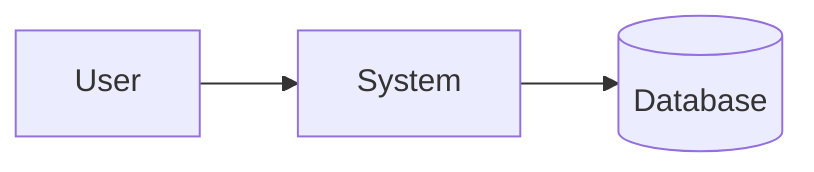

# PRD: <project name>

> Canonical skeleton for the PRD produced in Phase 1 of `project-bootstrap-guidelines`.
> This document is the single source of truth for *what* the project is and *why*. After Phase 2, every confirmed design decision also lives here.

## Problem statement

What are we solving, for whom, and why it matters. One short paragraph.

## Users / personas

Who will use this. For each persona: role, context, the job they're trying to get done.

- **Persona A** — …
- **Persona B** — …

## Goals

What the system must achieve. Keep this list short and measurable.

- …
- …

## Non-goals

What the system is **not** trying to do. Equally important — bounds the scope.

- …
- …

## Functional requirements

What the system must do. One bullet per capability. Keep each bullet testable.

- …
- …

## Constraints

Technical, regulatory, performance, budget, timeline. Anything outside our control.

- **Technical:** …
- **Regulatory / compliance:** …
- **Performance:** …
- **Budget:** …
- **Timeline:** …

## Success metrics

How we'll know it worked. Concrete, measurable, time-bound.

- …
- …

---

## System design

> Filled in during Phase 2. Every confirmed decision from the design conversation lands here.

### Flow diagram

Mermaid, embedded here. Promote to a separate `DESIGN.md` only if this section outgrows the PRD.

### Architecture

Components, their responsibilities, boundaries, and the interfaces between them.

- **Component A** — responsibility, inputs, outputs.
- **Component B** — …

### Framework / library / tooling choices

For each major choice, record what we picked, what we considered, and why.

| Choice | Picked | Alternatives considered | Why |
|---|---|---|---|
| Language | … | … | … |
| Framework | … | … | … |
| Database | … | … | … |
| Auth | … | … | … |
| Deployment target | … | … | … |
| Testing stack | … | … | … |
| CI | … | … | … |

### Best practices

Coding standards, testing strategy, branching model, review process. Enough detail that a new contributor can match the project's style on day one.

- **Coding standards:** …
- **Testing strategy:** …
- **Branching model:** …
- **Review process:** …
